# Exercise 1: Deploying Resources with Azure Developer CLI

### Estimated Duration: 30 Minutes

## Lab Scenario

In this exercise, you will deploy the necessary resources for your FastAPI application using the Azure Developer CLI (azd). You will set up your environment, initialize and configure the deployment process, and use azd commands to provision and deploy services in Azure. 

## Lab Objectives

After you complete this exercise, you will:

- Understanding Azure Developer CLI and the Deployment Workflow
- Streamlining Azure Resource Deployment with Azure Developer CLI (azd)

### Task 1: Understanding Azure Developer CLI and the Deployment Workflow

In this task, you will gain an understanding of the Azure Developer CLI (azd) and how it facilitates the deployment of cloud resources. You'll explore the main.bicep file, the core infrastructure template for your application, and learn about the primary resources it defines, including key parameters, dependencies, and outputs. By the end, you'll be familiar with how azd uses this file to automate provisioning, setting the foundation for deploying resources with ease in the next steps.

>**Lab Tip:** **azd (Azure Developer CLI)** is a command-line tool designed to streamline the process of building, deploying, and managing Azure applications. It simplifies the interaction with Azure resources by allowing developers to define infrastructure using code, deploy applications, and manage environments in a more efficient and automated way.

1. From the desktop, open **Visual Studio Code**.

   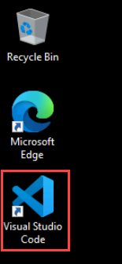

1. On the **Visual Studio Code** pane, select **Open Folder** under the **File** menu from the top menu bar.

   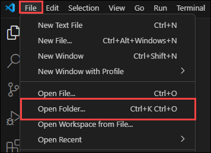

1. Navigate to the `C:\creative-writer\contoso-creative-writer-stage` directory. Click on **Select Folder**.

   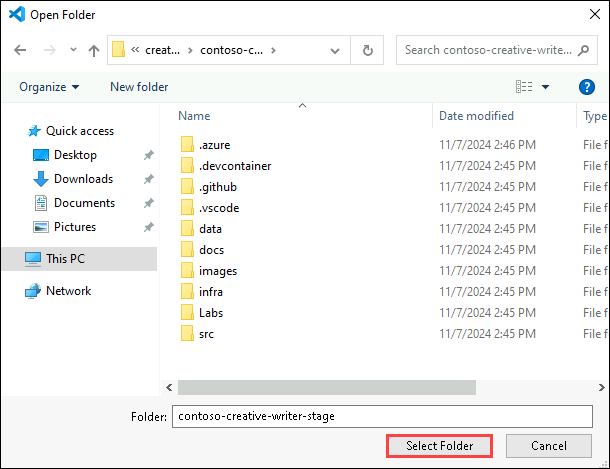

1. Once you have opened the folder in **Visual Studio Code**, on the "**Do you trust the authors of the files in this folder?**" pop-up, click on "**Yes, I trust the authors.**"

   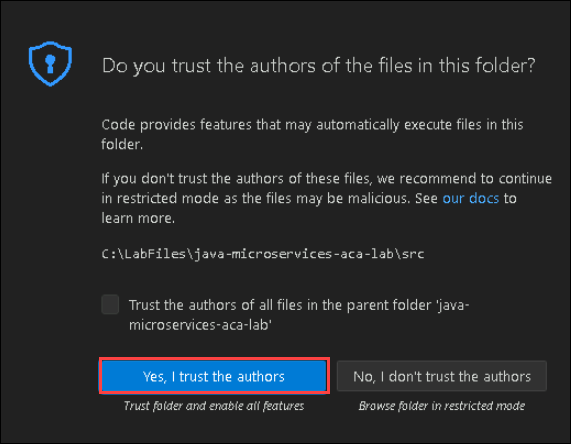

1. Once you have the **contoso-creative-writer-stage** directory opened, ensure you have the source code files from the **EXPLORER** pane handy.

   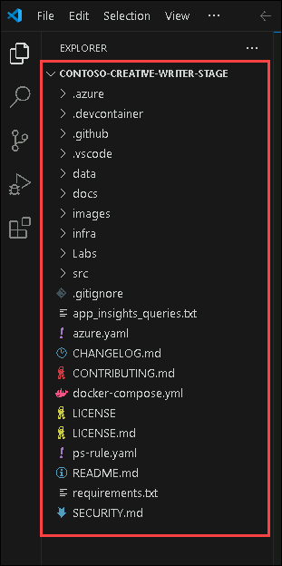
   
1. From the **Explorer** menu, navigate to the `/infra/main.bicep` file to review. A Bicep file is a simplified, readable syntax for defining and deploying Azure resources, which is compiled into ARM templates for deployment.

   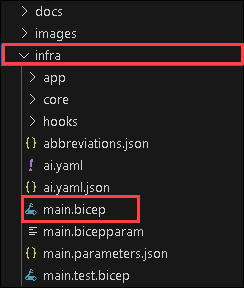

1. In the `main.bicep`, navigate to the **AI** module definition.
 
   ```bicep
    module ai 'core/host/ai-environment.bicep' = {
    name: 'ai'
    scope: resourceGroup
    params: {
        location: location
        tags: tags
        hubName: !empty(aiHubName) ? aiHubName : 'ai-hub-${resourceToken}'
        projectName: !empty(aiProjectName) ? aiProjectName : 'ai-project-${resourceToken}'
        keyVaultName: !empty(keyVaultName) ? keyVaultName : '${abbrs.keyVaultVaults}${resourceToken}'
        storageAccountName: !empty(storageAccountName)
        ? storageAccountName
        : '${abbrs.storageStorageAccounts}${resourceToken}'
        openAiName: !empty(openAiName) ? openAiName : 'aoai-${resourceToken}'
        openAiConnectionName: !empty(openAiConnectionName) ? openAiConnectionName : 'aoai-connection'
        openAiContentSafetyConnectionName: !empty(openAiContentSafetyConnectionName) ? openAiContentSafetyConnectionName : 'aoai-content-safety-connection'
        openAiModelDeployments: array(contains(aiConfig, 'deployments') ? aiConfig.deployments : [])
        logAnalyticsName: !useApplicationInsights
        ? ''
        : !empty(logAnalyticsWorkspaceName)
            ? logAnalyticsWorkspaceName
            : '${abbrs.operationalInsightsWorkspaces}${resourceToken}'
        applicationInsightsName: !useApplicationInsights
        ? ''
        : !empty(applicationInsightsName) ? applicationInsightsName : '${abbrs.insightsComponents}${resourceToken}'
        containerRegistryName: !useContainerRegistry
        ? ''
        : !empty(containerRegistryName) ? containerRegistryName : '${abbrs.containerRegistryRegistries}${resourceToken}'
        searchServiceName: !useSearch ? '' : !empty(searchServiceName) ? searchServiceName : '${abbrs.searchSearchServices}${resourceToken}'
        searchConnectionName: !useSearch ? '' : !empty(searchConnectionName) ? searchConnectionName : 'search-service-connection'
      }
    }
   ```

   >This module sets up essential AI infrastructure, such as Azure OpenAI, Key Vault, storage accounts, and log analytics.

   >It allows customization via parameters like OpenAIName, KeyVaultName, and StorageAccountName.

   >Additionally, it handles the setup for application insights and container registries.

1. The next part defines the configuration for deploying a Bing Search resource in Azure. It is set to be deployed globally and provides the search functionality for the application.

   ```bicep
   module bing 'core/bing/bing-search.bicep' = {
   name: 'bing'
   scope: resourceGroup
   params: {
      name: 'agent-bing-search'
      location: 'global'
      }
    }
   ```

   >This module configures a Bing Search resource in the global region, which will be used for search-related operations.

   >The name and location parameters can be customized to define the Bing service's characteristics.

### Task 2: Streamlining Azure Resource Deployment with Azure Developer CLI (azd)

In this task, you will be using the Azure Developer CLI (azd) to deploy the resources defined in your Bicep templates to Azure. The Azure Developer CLI simplifies the process of managing infrastructure as code, allowing you to efficiently deploy, manage, and monitor your applications and resources directly from the command line.

1. As you are on the **Visual Studio Code** pane, open the **New Terminal** option from the **Terminal** menu.

   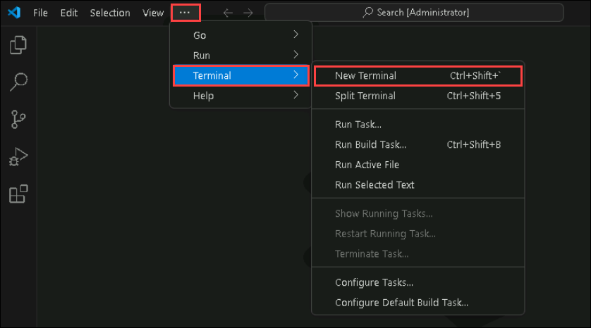

1. Once the **Terminal** is open, select **v (1)** from the right corner and click on **Git Bash (2)** from the menu.

   

   >**Lab Tip: Git Bash** is a command-line tool for Windows that lets users run Git commands and Unix-like shell commands.

1. Once the **GitBash** terminal opens, run the following command to sign in and authenticate the azd tool.

   ```bash
   azd auth login
   ```
1. Once you run this command, a sign-in page opens up. As you have already logged in to the portal, you just need to select your account and click on **Continue**.

1. Once you have logged in successfully, navigate back to your **GitBash** terminal and run the following command to authenticate the **Azure CLI** tool as well.

   ```bash
   az login
   ```
   >Note: You may need to minimize the Visual Studio Code pane to see the pop-up window to sign in.

1. Once you are on the pop-up window, select **Work or school account** and click on **Continue**.

   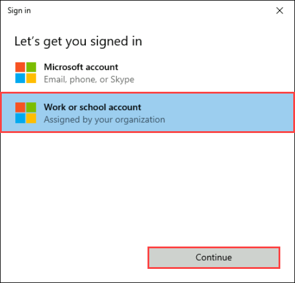

1. On the **sign in** page, provide the following:

   **Username**: <inject key="AzureAdUserEmail"></inject> and click on **Next**.

   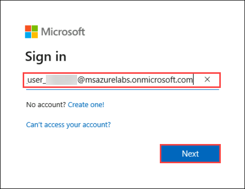

   **Password**: <inject key="AzureAdUserPassword"></inject> and click on **Sign in**.

   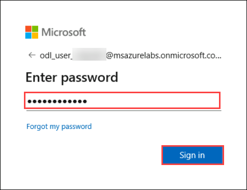

1. When prompted, click on **No, sign in to this app only**, and continue.

1. Return to your **Visual Studio Code** terminal. Now, it will prompt you to select a subscription from the list of subscriptions, enter **1**, and hit **Enter**.

1. Once you have successfully logged in, run the following command, which will deploy all the defined resources in Azure.

   ```
   azd up
   ```

1. Once you run this command, it will prompt you to select a subscription. Just hit **Enter** and continue.

   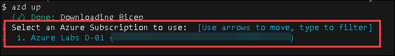

1. In the next prompt, it will ask to select a location. Use the arrow keys and select the **Canada East** region from the list.

   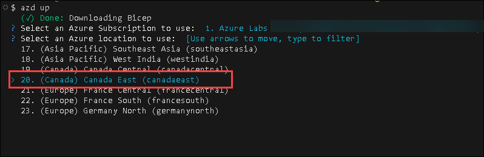

   >This may take upto 15 minutes to deploy all the resources. Till then, please move to the next exercise as that is a read-only exercise where you will learn the core application and technology stacks used.
   
   > If you encounter an error like "**Error executing step command**," please ignore it and proceed to the next exercise.

## Summary

In this exercise, you have learned how to use the Azure Developer CLI (azd) to deploy resources for your application. You explored how to define and configure infrastructure using a Bicep file, initialized tracing for monitoring, and successfully deployed resources such as container apps and AI environments using azd.

### You have successfully completed this exercise!!


