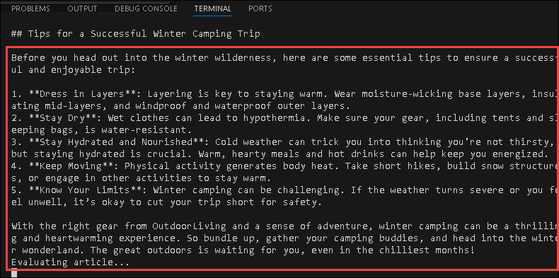
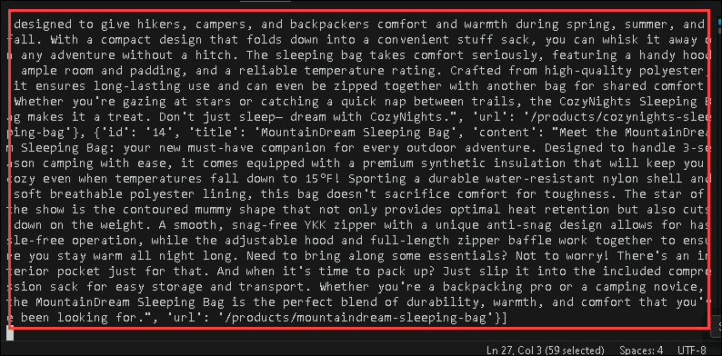
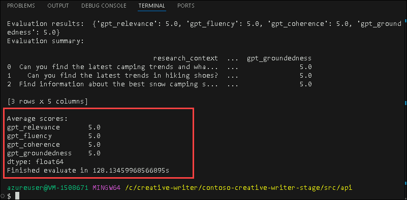

# Exercise 4: Debugging and Evaluating Application Logic

### Estimated Duration: 30 minutes

## Lab Scenario

In this exercise, you will debug and evaluate the core application logic. You will learn how to run the orchestrator, activate tracing for debugging purposes, and assess the generated content's quality. Additionally, you will explore how the application evaluates key response metrics such as Coherence, Fluency, Relevance, and Groundedness.

## Lab Objectives

After you complete this exercise, you will be able to:

 - Debug the application by running the orchestrator logic and enabling tracing.
 - Evaluate Application Response Quality.

### Task 1: Debug the application by running the orchestrator logic and enabling tracing.

In this task, you will run the orchestrator logic to simulate the application flow and enable tracing for debugging purposes. By doing so, you'll track the execution of Python functions and capture detailed traces, which will help in diagnosing any issues within the application's logic.

1. Navigate back to your **Git Bash** terminal, and open new **Git Bash** terminal and run the following command to go back to `/src/api` directory.

   ```bash
   cd src/api
   ```

   >Make sure you are running this in a new **Git Bash** terminal tab, because the application should be running.

1. Now as you are inside `api` directory, run the below command to run the orchestartor.

   ```bash
   python -m orchestrator
   ```

   

   >**LabTip:** The `orchestrator` manages and coordinates the execution of tasks in the application, ensuring components work together seamlessly.

   >Wait till the processs completes successfully

1. Now you have run the orchestrator without tracing, now we will be enabling tracing.

1. Run the below command to enable `LOCAL_TRACING`.

   ```bash
   export LOCAL_TRACING=true
   ```
   >**LabTip:** `Tracing` is the process of tracking and logging the execution flow of an application. Enabling tracing helps capture detailed insights into the operations, allowing you to monitor the sequence of function calls, identify performance bottlenecks, and troubleshoot issues by providing a step-by-step view of the system's behavior. This is particularly useful for debugging and improving the application.

1. Now again you will be running orchestrator with local tracing enabled. Now you will be getting more detailed logs.

   ```bash
   python -m orchestrator
   ```

   

1. Navigate back to your application which is running on browser. Genrate a article to check the working of orchestrator.

### Task 2: Evaluate Application Response Quality

In this task, you will evaluate the quality of the application’s responses using predefined metrics. The Contoso Creative Writer project employs evaluators to assess four key aspects: Coherence, Fluency, Relevance, and Groundedness. You will run a custom evaluation script to automatically assess the generated content based on these metrics.

>**LabTip:** 
   - **Coherence:** Measures how logically consistent and well-structured the response is.
   - **Fluency:** Assesses the natural flow and readability of the language in the response.
   - **Relevance:** Evaluates how closely the response aligns with the provided context and requirements.
   - **Groundedness:** Checks if the response is supported by accurate, reliable, and factual information.

1. As you verified logs of your application, now it's time to evaluate the response quality of the application. The 4 metrics the evaluators in this project assess are Coherence, Fluency, Relevance and Groundedness.

1. In the **Git Bash** terminal, run the following command to start evaluating and genrate results.

   ```bash
   python -m evaluate.evaluate
   ```

   

   >Wait till the process is successfully completed and the results are generated.

1. These scores will range from 1 (low quality) to 5 (high quality). You can check the scores genrated and evaluate the response quality of your application.

## Summary

In this exercise, the orchestrator logic was run with tracing enabled to debug the article generation process. The quality of the article was then assessed using a custom evaluation script, measuring Coherence, Fluency, Relevance, and Groundedness. Scores were provided for each metric, helping to assess the overall article quality.

### You have sucessfully completed the Lab!!
